# RM-Project - Real Madrid fan website project

Hello and welcome, in this project you can see basic information about the Real Madrid football club. I would like to find and connect people who are passionate about Real Madrid and they can talk, meet up, and watch the game together in a safe environment from all over the world. 

# user story 

* As a visiting user, I would like to view images of the Real Madrid
* As a visiting user, I would like to read information about Real Madrid
* As a visiting user, I can find reasons for supporting the club.
* As a visiting user, I can sign up to become a fan club member
* As a visiting user, I can visit the social media of the page

# Features Navbar placed on top with five futures to travel through the page

* Navbar stick to the top of the page
    * Users can see the Logo and Name of the football club
    * The first future is Home after clicking the user to the top of the page
        * When you point the cursor at it it shows an underlined 
        * The second future is Gallery after clicking takes the user directly to photos
        * When you point the cursor at it it shows underlined
        * The third future is Why Us, after clicking takes the user to the section
        * When you point the cursor at it it shows underlined
    * The fourth future is Special Info clicking takes the user to the section
        * When you point the cursor at it it shows underlined
* The fifth future is Sign Up clicking takes the user to the form
    * When you point the cursor at it it shows underlined
    
* The main heading has a background picture of Real Madrid players Users can see a large title Became Madridista!
* Users can see the Join in button
    * When pointing the cursor on the button underline change the color
    * When the user clicks the Join in button takes the user to the form section
    
* The gallery section is filled with pictures for visiting user
    * When pointing the cursor in Gallery it changes shape 
    * When pointing the cursor at the picture, the image gets bigger
    * Responsive column set up
        * Small screens one column
        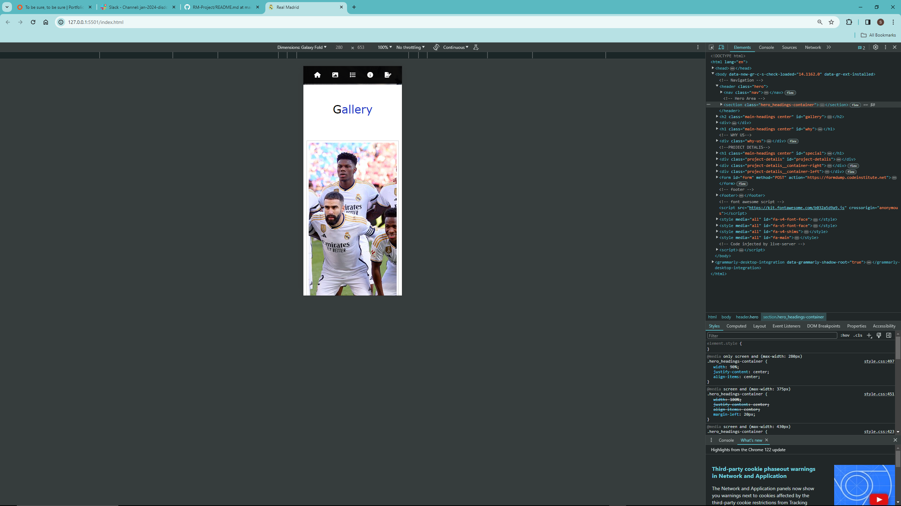
        
* Medium screens two columns
    * Big screen three columns 
    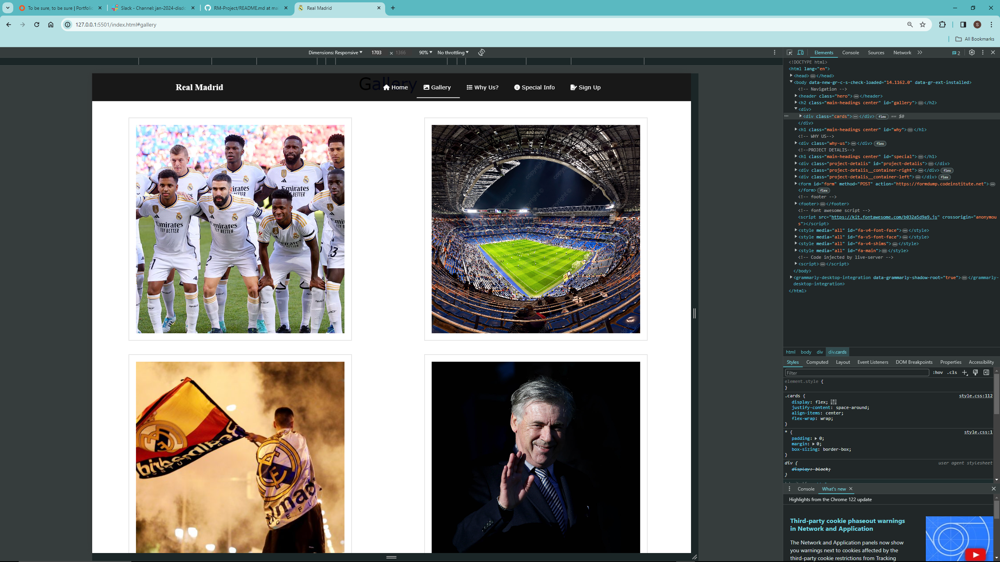
* Why Join Us ? section presents reasons to join in for visiting user
    * When pointing the cursor on Why Join Us? it's changed shape 
    * When pointing the cursor at the image it gets bigger 
    * When pointing the cursor on one of the reasons text gets bigger
    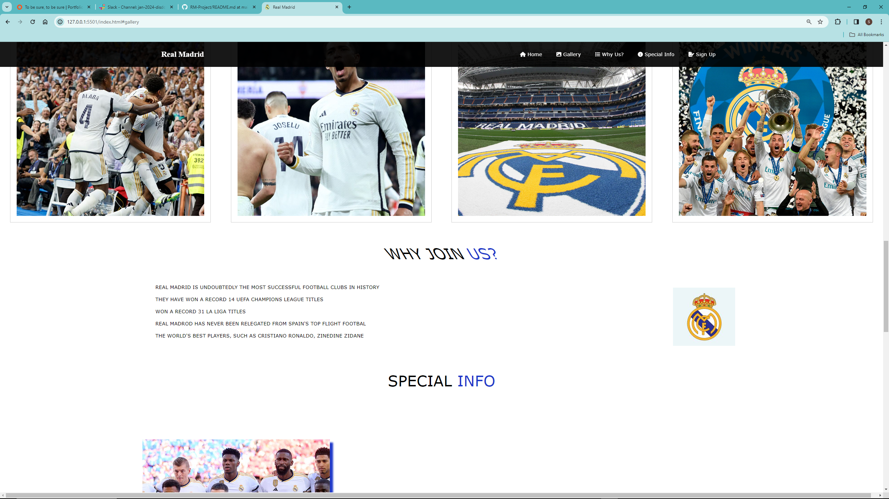
    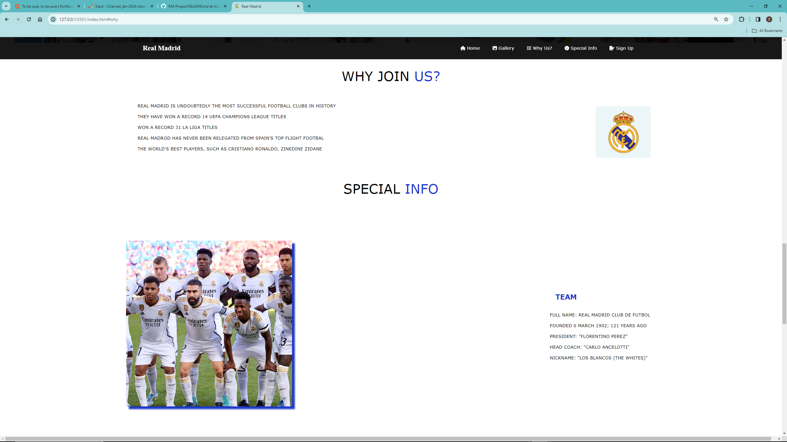
    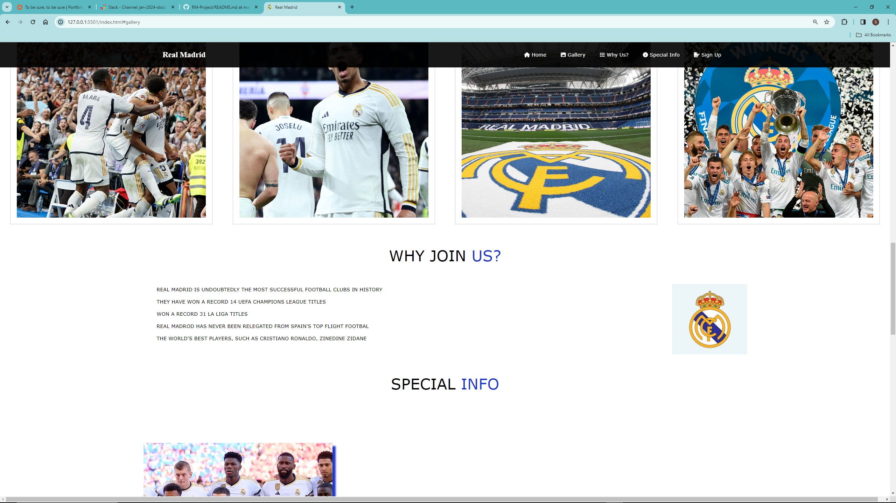
    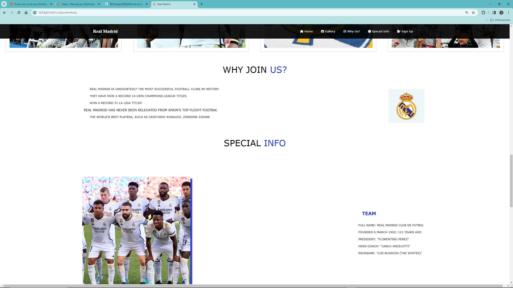
* A special info for visiting users is information 
    * Visiting users can read information about Real Madrid
    * When pointing the cursor on the image it changes shape 
    * Pictures have a shadow effect
    * Each subsection has a title 
    * When pointing the cursor on one of the texts listed it gets bigger
    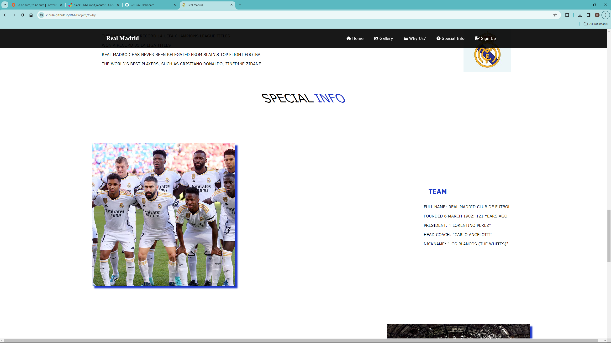
    
    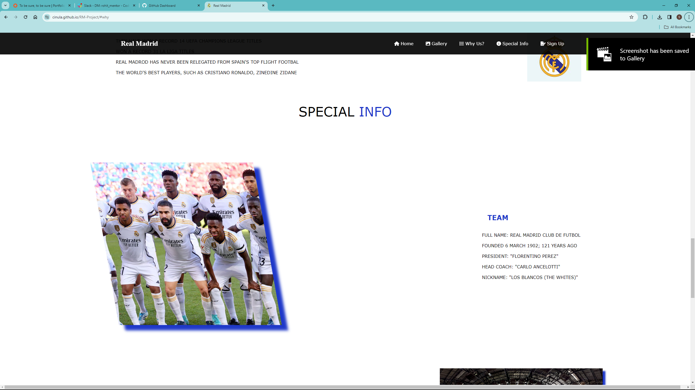
* Sign up! the section is a form to fill up for users to join the fan club
* The form has a box to type Name 
    * To sign up Name field needs to be filled in for submitting the form The form has an email box to type
    * To sign up email address needs to be filled in correctly for submitting the form
* The form has a password box to type 
    * To sign up user needs to type in a password The form has a submit button named Join Us!
    * Users can only submit the form if all boxes are filled correctly
    * Users can push the Join Us! button
    * After sending the form the website takes you to the Code Institute website
    
* The footer is based at the bottom of the page 
    * The footer section has a blue background
    * There is a title in the middle Find Us on Social media
* Users can find the icons symbolizing social media 
    * When the cursor points at one of the icons the icon changes color 
    

# Future features 

I would like to grow my website and improve it for better quality and to bring more users. I am planning to create in the future :
 *  Chat with registered users, for communication and get to know each other 
 * Find people who support this same club like visiting users
 * Shop for souvenirs or gifts, like Real Madrid t-shirts and jerseys
 * Calendar with Real Madrid game schedule
live updates on matches
 * Could Create another website like this for other football clubs  
 * Unlimited potential for many more features in the future.  

# Typography and color scheme 

I use the colors white and blue like the Logo of Real Madrid Clube to be connected with the website, which I believe is nice visible, and readable. 
I use the font-family Verdana to style the text, for easy reading and visibility. 

# technology 

* Main technology 
    * Visual studio code
        * HTML language to write code
        * CSS to style the website  
        * Live server future to review code
    * Google browser 
        * Google inspects
* GitHub and Git 
    * Display repository 
    * Comiting code to the repository 
* HTML code Validator [link to HTML validator](https://validator.w3.org/)
* CSS code Validator [link to CSS validator]
* Grammarly for grammar and spelling mistakes.

# testing 

* Tested in HTML code validator [link to HTML validator](https://validator.w3.org/)
    * Document checking completed. No errors or warnings to show
    
* Tested CSS code validator [link to CSS validator](https://jigsaw.w3.org/css-validator/)
    * No Error Found
    

* Lighthouse test by Google inspects tool. 
    * No errors found
    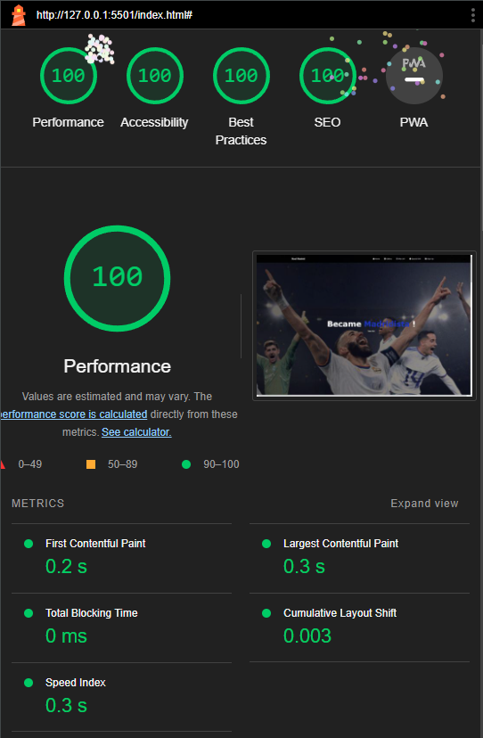

* Tested Navigation Bar 
    * The home link was tested and works correctly and takes the user to the top of the page after clicking. The navbar for smaller screens is getting smaller and only icons stay on top. The navbar is sticky to the top of the page
    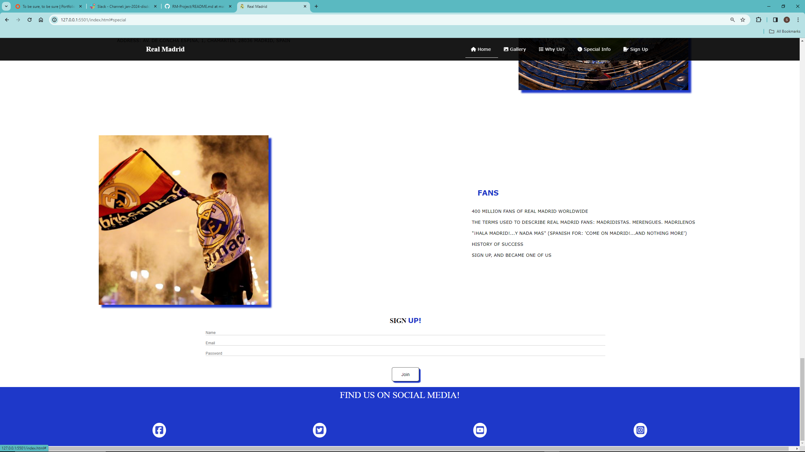
    
    
* The main heading was tested and worked correctly
    * The Join Us button was tested, the link works correctly and takes the user to the form section, which he could fill up and become a member of the Fan Real Madrid fan club. 
    
    

* The Gallery link was tested and worked correctly taking a user to the Gallery section, The user can navigate straight from the navbar by clicking the gallery field on the navbar.
        
        * The Gallery section on the phone is in one column and is responsive with bigger screens and for screens changes to two columns and 3-to 4 columns on the wide PC screens. images getting bigger after the cursor points it.
        
        
        
        
        

    * Why join Us? The link was tested and worked correctly to take a user to the Why Us section after clicking. The section is interactive with the user when you point to the cursor for the title it changes shape, when you point to the cursor for text it gets bigger, when you point to the cursor on Logo it gets bigger.
        
        
        
                

    
    *   The special info link was tested and worked correctly to take the user to that section Special info. The section is interactive with the user when you point to the cursor for the title it changes shape, when you point to the cursor for text it gets bigger, when you point to the cursor on images it changes shape.
    
    
    
    

* Sign up! The section is for people who would like to become members of the Real Madrid fan club. The user can fill out the form there are 3 sections to fill up. Users can start navigating from the navbar or pushing the join-in button on the main website head.
    
    
    
    * the section was tested and worked correctly Users need to type the Name field to Sign up, users can not leave this section empty if that person would like to sign up. If fails then the sign-up button won't work. It will come up message "Please fill this field"
    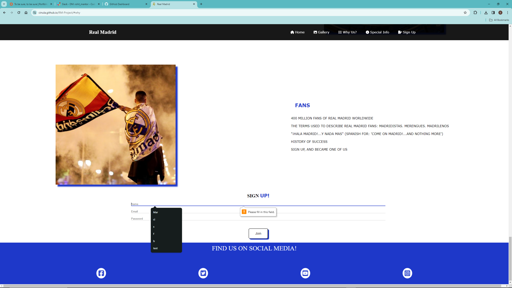
    
    * The user needs to type the correct email address to sign up, if fails then the sign-up button won't work. It will come up message "Please fill this field"
    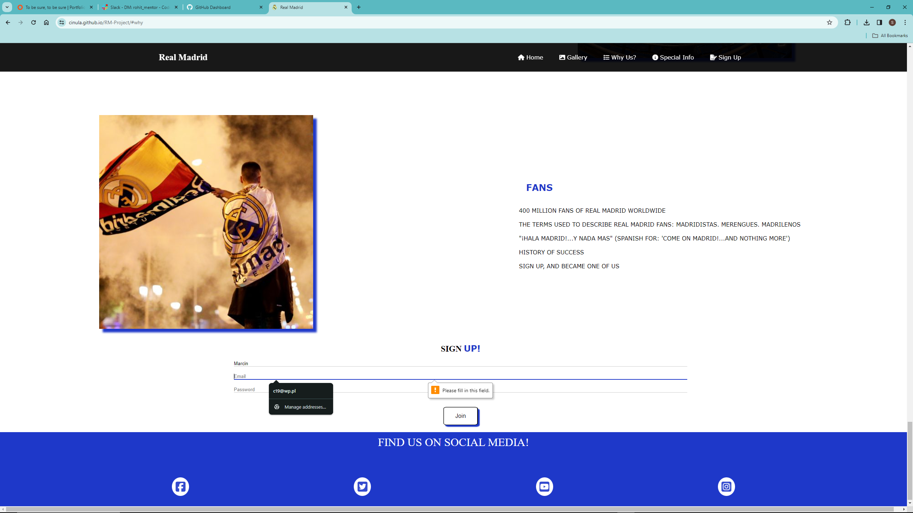

    * Users need to type in a password to sign up The user needs to press the Join in submit button to sign up After the user signs up takes a user to the Code Institute website. If fails then the sign-up button won't work. It will come up message "Please fill this field"
    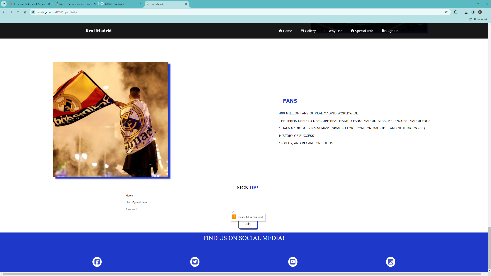
    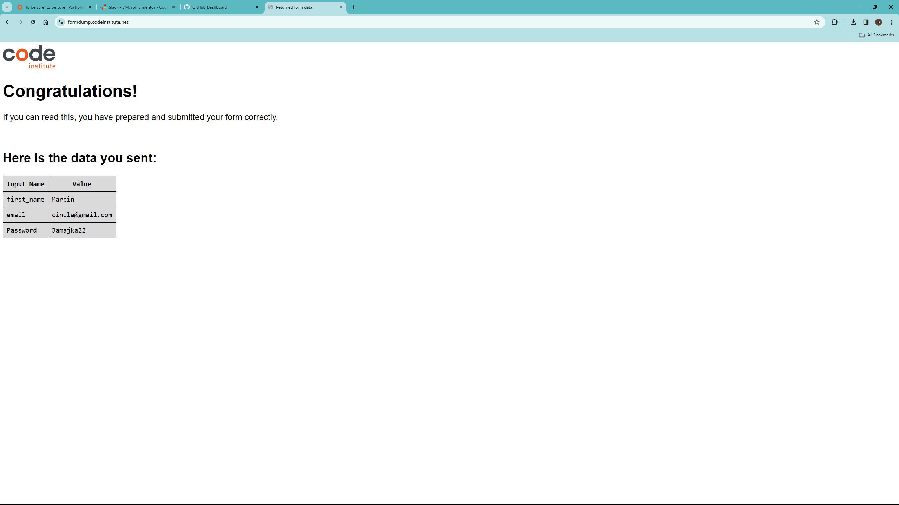

* The footer was tested and works correctly The footer provides links to social media 
    * Social media icons change color when the cursor points to them After clicking Facebook icon takes the user to the Facebook page After clicking Twitter icon takes the user to the Twitter page After clicking YouTube icon takes the user to the YouTube page After clicking the Instagram icon takes a user to the Instagram page 
    

# Bugs and errors 

* Had too many H1 elements in my projects, there should be only 1 H1 element as a title. 
    * I did change all H1 elements to H2 elements except Title.
I have an error with the section element, Had a section element without the title, to swap all section elements to a divs element. Divs do not need to have a title. A lot of HTML & CSS:

    * typing mistakes 
    * semi-colon missing 
    * colon missing 
    * brackets missing

        * to fix it I had to review the code find all the missing attributes and place it in the right order.  

* picture size and quality, some of the images were poor quality too big or too small. 
    * To fix it had to use a tool to resize to images to fit the style. 

*  The website content was too crowded
Remove some unnecessary content like numbers on the list for better style and visibility.

# Deployment

This website was deployed to the GitHub page as my repository the steps are below.
* In GitHub navigate to the repository
Click on setting ( last section on navbar)
    * Find "Pages" on the drop-down menu 
    * left-hand side of the drop-down many find Build and Deployment
    * choose to deploy from a branch below choose the main branches and root folder 
        * save
The live link can be found here [link](https://cinula.github.io/RM-Project/)

# Credits

* Content
    * The information for the website page (special info section) was taken from the Wikipedia Real Madrid article.
    * Code institute and love running projects helped me a lot in understanding a lot of content 
    * I gathered information for a better understanding of the page layout and navbar of the page on YouTube the links are below: 
        [Positioning](https://www.youtube.com/watch?v=MxEtxo_AaZ4)
        [Leyout](https://www.youtube.com/watch?v=3C_22eBWpjg)
        [navbar](https://www.youtube.com/watch?v=5zDYchk3C5k)
    * The icons in the footer were taken from Font Awesome
* Media
    * The background images were gathered from an open-source site.
    * The gallery photos were gathered from an open-source site.

* Acknowledgment
    * Special thanks to my mentor, "Rohit Sharma" for helping me with my first project. 
        